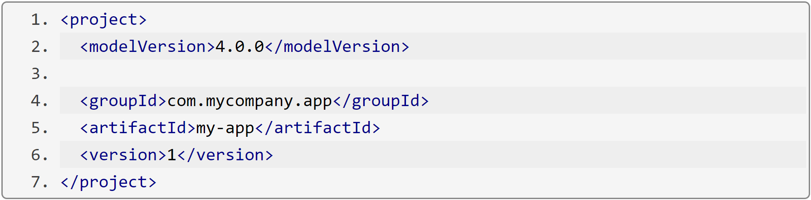
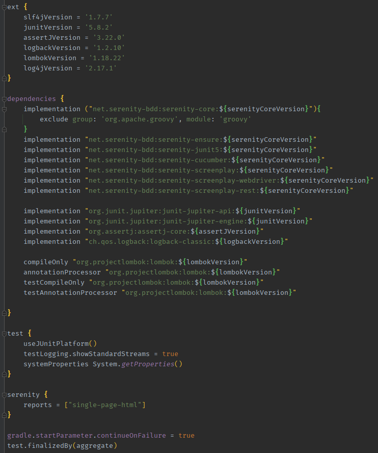
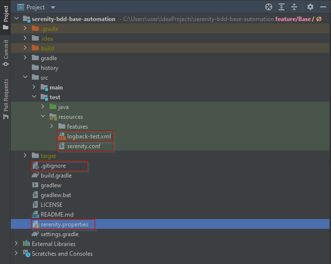

# Documentación automatizacion de pruebas de softaware

Este repositorio contiene información clave para iniciar con la automatizacion de pruebas de software usando Java,
Serenity BDD y Cucumber. Además encontrarás detalles de implementación usando patrones de diseño POM y Screenplay. El
enfoque son pruebas web y API.

## Tabla de contenidos
1. [Pre-requisitos](#pre-requisitos)
2. [Gestor de dependencias](#gestor-de-dependencias)
3. [Estructura base del proyecto](#estructura-base-del-proyecto)
4. [Patrones de diseño](#patrones-de-diseño)
5. [Autor](#autor)
6. [Copyright](#copyright)

## Pre-requisitos
- [Java](https://www.oracle.com/java/technologies/downloads/archive/): Tener instalado el JDK de java en su versión mínima de 8 o superior.
- [Variables de entorno](): Configurar las variables de entorno para Java y el gestor de dependecias (Gradle o maven).
- [IDE](): Tener instalado un entorno de desarrollo para proyectos Java como [Eclipse](https://www.eclipse.org/downloads/) o [IntelliJ IDEA](https://www.jetbrains.com/es-es/idea/). Se recomienda el uso de este último.
- [Plugins](): Instalar en su entorno de desarrollo los siguiente complementos:
  - Gherkin
  - Cucumber for Java
  - Lombok
  - Sonarlint

## Gestor de dependencias
Para administrar las dependencias de tu proyecto de automatización puedes utilizar:
- [Maven](https://maven.apache.org/): Se trata de un archivo llamado `POM.xml`, donde se utilizan etiquetas XML para agregar dependecias, complementos y demás configuración requerida. A continuación, se muestra un ejemplo:
   
  
- [Gradle](https://gradle.org/): Gradle por su parte centra la información en un archivo llamado `build.gradle`, donde puede utilizarse lenguaje Groovy o Klotin para agregar las dependencias, plugins y otras configuraciones del proyecto.
  

Para efectos de este instructivo se utilizará como administrador de dependecias Gradle.

## Estructura base del proyecto

Para iniciar un proyecto de automatización se deben tener una estructura básica de archivos dentro de un proyecto base
de java.

Los archivos adicionales que deben acompañar el proyecto son:

- [serenity.conf]() - En este archivo podemos configurar todo lo relacionado con el navegador que queremos usar para
  ejecutar nuestras pruebas web, además de indicar
  las [capabilities](https://serenity-bdd.github.io/docs/guide/driver_config) del navegador. Entre otras cosas se
  encuentra:
    - Configurar si deseas usar un binario o drive para una versión especifica del navegador. En las versiones recientes
      de Serenity puedes olvidarte de descargar el binario y que el core gestione la descarga automatica del driver para
      ejecutar las pruebas. Esto último es lo mas recomendable por temas de mantenibilidad.
    - Configurar si queremos que el navegador se ejecute en segundo plano o si quieres ver lo que está haciendo.
    - Indicarle a Serenity que tome capturas por cada paso, cada acción, etc.
    - Configurar los diferentes entornos que podemos necesitar para ejecutar nuestras pruebas. Ambientes como QA, UAT,
      DEV o default.
- [logback-test.xml]() - Este archivo permite que el core de Serenity BDD muestre la información en consola de las
  acciones que se realizan, además este archivo permite utilizarse para implementar nuestros logs
  usando [logback](https://logback.qos.ch/index.html).
- [.gitignore]() - Archivo que le indica a git que cambios debe ignorar y no se deben subir al repositorio. En este
  archivo se le indica que ignore el folder `target` por ejemplo, que es donde se almacenan los reportes de serenity.
- [serenity.properties]() - Archivo para indicarle a Serenity donde encontrar los `tests` del proyecto, configurar
  información adicional que se quiere mostrar en el reporte.

## Patrones de diseño

- [Page Object Model (POM)]():
- [Screenplay]():

## Autor

## Copyright
Publicado bajo la Licencia MIT, ver el
archivo [LICENSE](https://github.com/DiegoPinzon20/doc-automatizacion-pruebas/blob/master/LICENSE).
